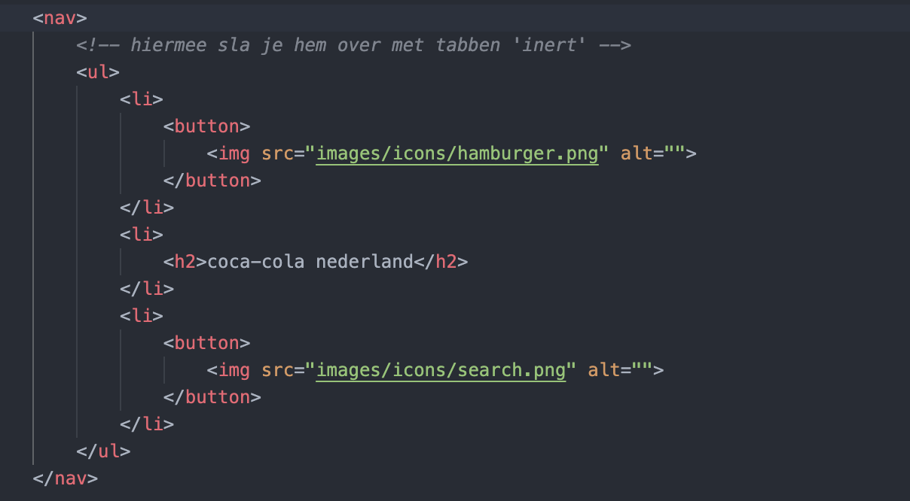
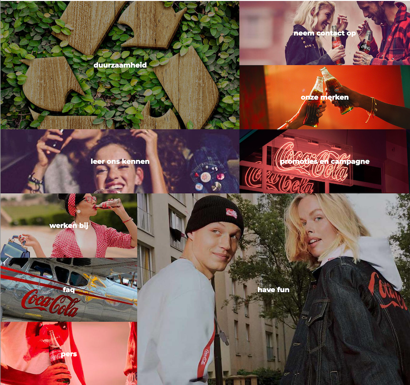
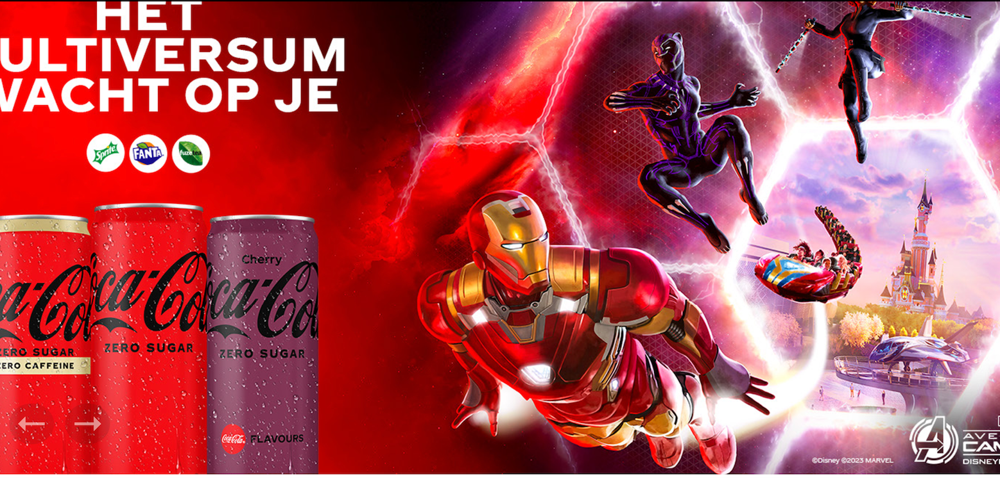

# Procesverslag
Markdown is een simpele manier om HTML te schrijven.  
Markdown cheat cheet: [Hulp bij het schrijven van Markdown](https://github.com/adam-p/markdown-here/wiki/Markdown-Cheatsheet).

Nb. De standaardstructuur en de spartaanse opmaak van de README.md zijn helemaal prima. Het gaat om de inhoud van je procesverslag. Besteedt de tijd voor pracht en praal aan je website.

Nb. Door *open* toe te voegen aan een *details* element kun je deze standaard open zetten. Fijn om dat steeds voor de relevante stuk(ken) te doen.

## Jij

  
uitwerken voor kick-off werkgroep

  ### Auteur:
  Menno Vlaming

  #### Je startniveau:
  Rood

  #### Je focus:
  Responsive
 

## Je website

  
uitwerken voor kick-off werkgroep

  ### Je opdracht:
  https://www.cocacolanederland.nl
  https://www.cocacolanederland.nl/onze-merken-en-verhalen

  #### Screenshot(s) van de eerste pagina (small screen): 
  hier de naam van de pagina  
  

  #### Screenshot(s) van de tweede pagina (small screen):
  hier de naam van de pagina  
  

 <!--
 git add .
 git commit -m "message"
 git push
  -->
  

## Toegankelijkheidstest 1/2 (week 1)

  
uitwerken na test in 1e werkgroep

  ### Bevindingen
  Lijst met je bevindingen die in de test naar voren kwamen:

  #### Screenreader
 Screenreader werkt niet goed, dit heeft dezelfde reden als dat hij niet goed te gebruiken is met het hamburgermenu, hier zie je deze meeste content dus dat is echt iets wat je mist.

  #### Muis en Toetsenbord 
  De site is duidelijk bedoeld om met de muis te gebruiken, met toetsenbord is het gewoon niet erg bruikbaar. Voor de content die je wilt zien moet je het hamburgermenu gebruiken, dit is gewoon niet te doen met alleen het toetsenbord, omdat je hier niet op komt. Wel is er goed rekening gehouden met de hoeveelheid van de links waar je op kan tabben, het zijn er niet te veel.

  #### Motoriek (shocks, elastiekjes)
 Bevindingen die ik heb gevonden met het gebruik van elastiekjes:
  De site is goed te gebruiken, het duurt allemaal wat langer, maar als je je goed concentreerd is het prima te doen, wel verlvelend als je haast hebt.

Bevindingen die ik heb gevonden met het gebruik van shocks:
  De site is bij de eerste shocks (parkinson, trillingen) nog te gebruiken, kleine knoppen zijn lastig, dingen zoals typen is niet te doen.

  Bij de tweede shocks (spasme voor korte tijd) was de site redelijk te bedienen, alleen op het moment van de shock kan je niks.

  Bij de derde shocks (eerste stand, spasme langere tijd) is de site eigenlijk niet te bedienen, de enige manier waarop je hier op een site zou kunnen is als je hele korte secties hebt. 

  #### Visueel (brillen, contrast, kleurenblind, dark/light). 
  Met de brillen afzonderlijk is de website nog redelijk te gebruiken, in combinatie eigenlijk niet.

  Voor kleurenblinden is deze website nog goed te gebruiken, voor hovers gebruiken ze underlines onder de tekst in plaats van andere kleuren, dit is een goede oplossing hiervoor, ook een goede oplossing hiervoor is het gebruik van de weight van de font, dit is ook zonder kleur te zien.

  Met dark en light mode veranderd de site niet, dit is denk ik omdat rood kenmerkend is voor coca cola, en ze die niet willen veranderen.

## Breakdownschets (week 1)

  
Breakdown schets

  ### de hele pagina: 
  

## Voortgang 1 (week 2)

  
uitwerken voor 1e voortgang

  ### Stand van zaken
  hier dit ging goed & dit was lastig (neem ook screenshots op van delen van je website en code)

  ### Agenda voor meeting

  | Menno: 
  | ik heb een vraag over het semantisch maken van mijn HTML, mijn CSS luistert niet en ik weet niet hoe het komt.

  | Hilal: 
  | Vraag 1: Doe ik de fontface goed op deze manier?
  | Vraag 2: Vind een carousel starten lastig, vooral als je bij het swipen de nummers ziet veranderen zoals op mijn site. Hoe kan ik dit het beste aanpakken en heb ik hier javascript voor nodig?

  | Laiba: 
  | vraag over font
  | css bestanden
  | vraagje over een html element (pijltjes)

  | Wessel: 
  | Vraag over wanneer je grid gebruikt en wanneer flexbox

  ### Verslag van meeting
  Het probleem waar ik tegenaan liep was een HTML element dat niet luisterde naar mijn CSS, 
  voor het gemakt had ik mijn navigatiebar gemaakt met behulp van classes, iets waar ik 
  later vanaf wou stappen. Toen ik de classes om wou zetten naar semantische HTML luisterde mijn
  CSS niet meer. Tijdens de meeting is het mij duidelijk geworden dat ik niet de juiste volgorde had 
  aangehouden voor mijn CSS, vandaar dat sommige elementen niet luisterde. 

## Voortgang 2 (week 3)

  
uitwerken voor 2e voortgang

  ### Stand van zaken
  hier dit ging goed & dit was lastig (neem ook screenshots op van delen van je website en code)

  ### Agenda voor meeting
  samen met je groepje opstellen

  | Menno: 
  | ik heb een vraag over het semantisch maken van mijn HTML, 
  | mijn CSS luistert niet en ik weet niet hoe het komt.

  | Hilal: 
  | Vraag over de breakdown schets

  | Laiba: 
  | Vraag 1
  | Formulieren, hoe moet je erin verwerken?
  | Vraag 2 (Surface plane)
  | Mag ik het verstoppen? 
  | (Surface plane)
  | css bestanden
  | vraagje over een html element (pijltjes)

  | Wessel: 
  | Vraag 1
  | Hamburger menu openen lukt, maar weer sluiten lukt niet. Hoe komt dit?
  | Vraag 2
  | Display flex items plaatsen hoe ik wil zonder, losse items van space between
  | Vraag 3
  | Hoe ontwerp je het kruisje dat input form leegt?

  ### Verslag van meeting
  

## Toegankelijkheidstest 2/2 (week 4)

  
uitwerken na test in 8e werkgroep

  ### Bevindingen
  Lijst met je bevindingen die in de test naar voren kwamen (geef ook aan wat er verbeterd is):

  #### Screenreader
 Bij het begin kreeg ik een probleem met de screenreader, hij wou de button van mijn navigatiemenu niet openen, dit bleek een typefout te zijn. Verder leest hij ook als de navbar ingeklapt is alle links voor, dat kan misschien verwarrend zijn.

 Het beste gedrag voor de screenreader zou zijn dat de navigatiebar openklapt als iemand er 'in' tabt, en hem weer sluit als je er uit tabt, zodat de gebruiker altijd alle links te zien krijgt.

  #### Muis en Toetsenbord 
 Ik heb voor de 'Home' knop een h2 gebruikt, dit is niet optimaal voor screenreaders, ik heb dit veranderd in een link.
 #### before
 

 #### after
 

  #### Motoriek (shocks, elastiekjes)
  Met de schokken en elastiekjes is mijn webiste prima te gebruiken, ik maak gebruik van grote secties met veel 
  afbeeldingen zodat je geen last hebt van kleine lastige klikbare dingen.

  #### Visueel (brillen, contrast, kleurenblind, dark/light). 
  Om mijn website beter te laten werken voor kleurenblinden, heb ik bij hovers in plaats van alleen een kleur die 
  veranderd, ook ervoor gezorgd dat de button of tekst word underlined.

## Eindgesprek (week 5)

  
uitwerken voor eindgesprek

  ### Je uitkomst - karakteristiek screenshots:
  
  

  ### Dit ging goed/Heb ik geleerd: 
  Korte omschrijving met plaatjes
  Ik ben erg blij met dit grid, ik had nog nooit eerder met CSS grid gewerkt, 
  nu begrijp ik dit beter en vind ik dat het best goed gelukt is. 
  

  ### Dit was lastig/Is niet gelukt:
  Omdat ik de slider van coca cola zelf niet goed vond werken, (het switchen van afbeeldingen was stuk (?))
  Heb ik besloten om deze zelf te maken, achteraf had ik graag een automatische slider gemaakt die ik ook met 
  de pijltjes kon bedienen, dit werd lastig i.v.m. de tijd.

  

## Bronnenlijst

  
continu bijhouden terwijl je werkt

  

  1. https://www.freecodecamp.org/news/semantic-html-alternatives-to-using-divs/
  2. https://www.youtube.com/watch?v=9HcxHDS2w1s&ab_channel=WebDevSimplified
  3. https://w3collective.com/scroll-to-top-button-javascript/
  4. https://developer.mozilla.org/en-US/docs/Web/CSS/filter-function/invert
  5. https://css-tricks.com/snippets/css/complete-guide-grid/
  6. https://css-tricks.com/snippets/css/a-guide-to-flexbox/

